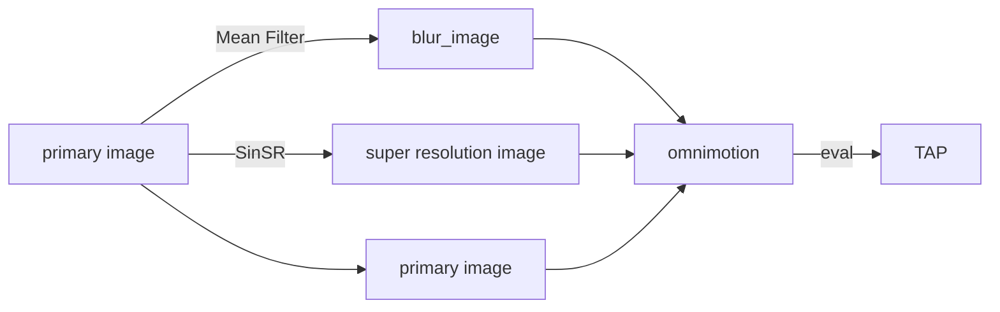

# [mitsukisohara.github.io](https://mitsukisohara.github.io/)

\
\
Reference：
1. Wang Q, Chang Y Y, Cai R, et al. Tracking everything everywhere all at once[C]//Proceedings of the IEEE/CVF International Conference on Computer Vision. 2023: 19795-19806.
2. Wang Y, Yang W, Chen X, et al. SinSR: diffusion-based image super-resolution in a single step[C]//Proceedings of the IEEE/CVF Conference on Computer Vision and Pattern Recognition. 2024: 25796-25805.
3. Doersch C, Gupta A, Markeeva L, et al. Tap-vid: A benchmark for tracking any point in a video[J]. Advances in Neural Information Processing Systems, 2022, 35: 13610-13626.

\
\
The website template is borrowed from [omnimotion](https://github.com/omnimotion/omnimotion.github.io).